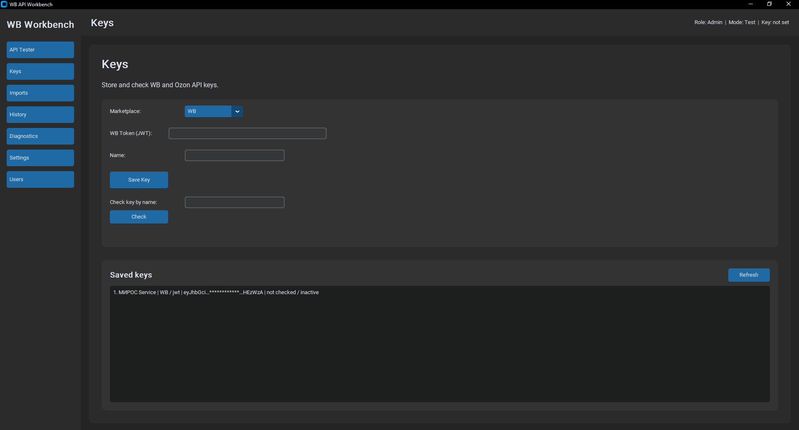
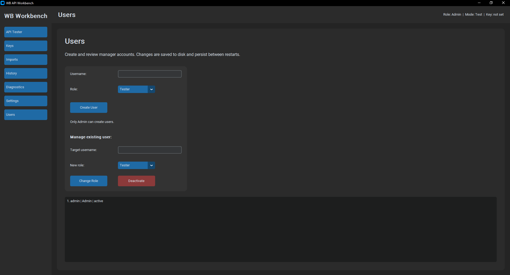
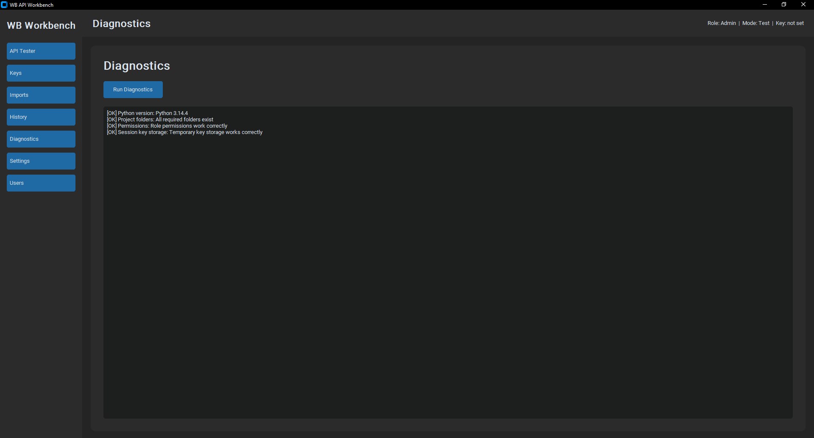

# WB API Workbench

Локальное GUI-приложение для работы с Wildberries API.

## Цель проекта

Портфолио-проект на Python для демонстрации:

- работы с внешним API;
- GUI-разработки;
- локального хранения данных;
- безопасного хранения API-ключей;
- работы с JSON-схемами;
- импорта локальных выгрузок;
- проектирования прав доступа.

## Основные возможности

- ввод и хранение API-ключей WB и Ozon;
- проверка живости ключа: WB — пинг разделов API по правам токена,
  Ozon — отдельная проверка Seller и Performance credentials;
- тестирование методов Wildberries API;
- просмотр request/response JSON;
- сохранение raw JSON в локальную БД;
- импорт JSON / CSV / Excel выгрузок;
- роли доступа: Viewer, Tester, Operator, Admin;
- история запросов;
- локальное обновление API-схем.

## Скриншоты

| Keys | Users | Diagnostics |
|---|---|---|
|  |  |  |

## Статус

Версия v0.3 — GUI MVP в работе.

## Текущий прогресс

- структура проекта, Git, виртуальное окружение, pyproject.toml;
- ролевая модель доступа (Viewer / Tester / Operator / Admin) и единая матрица прав;
- режимы Test / Real с правилом доступа к Real;
- логика пользователей: создание, защита от дублей, поиск, смена роли, деактивация;
- JSON-персистентность пользователей (переживают перезапуск);
- три варианта хранения ключей: keyring, шифрованный файл, сессия;
- диагностика окружения;
- декодер JWT-ключей WB (кабинет, права по битам, срок действия);
- проверка живости ключей: WB (пинг разделов) и Ozon (Seller + Performance);
- БД-слой подключён: SQLite создаётся при старте, CRUD-репозитории
  для ключей и истории запросов, метаданные ключа несут маркетплейс и тип;
- GUI-каркас и рабочие разделы: Diagnostics, Settings, Users, Keys
  (WB + Ozon: сохранение, проверка живости, список с масками);
- 101 тест (pytest) на core-логике + скриптовый смоук-тест на GUI.

## Дальше

- скролл в списке пользователей (быстрая добивка);
- кэширование результата проверки ключа (чтобы не дёргать API на каждый клик);
- API Tester поверх готового http_client.
